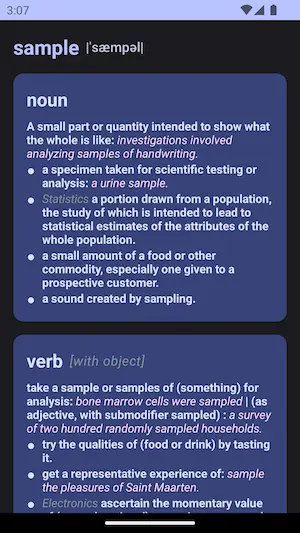
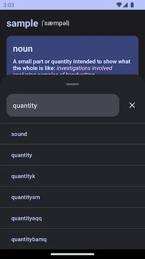
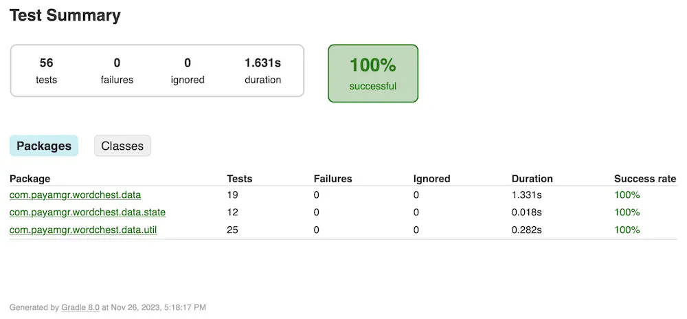
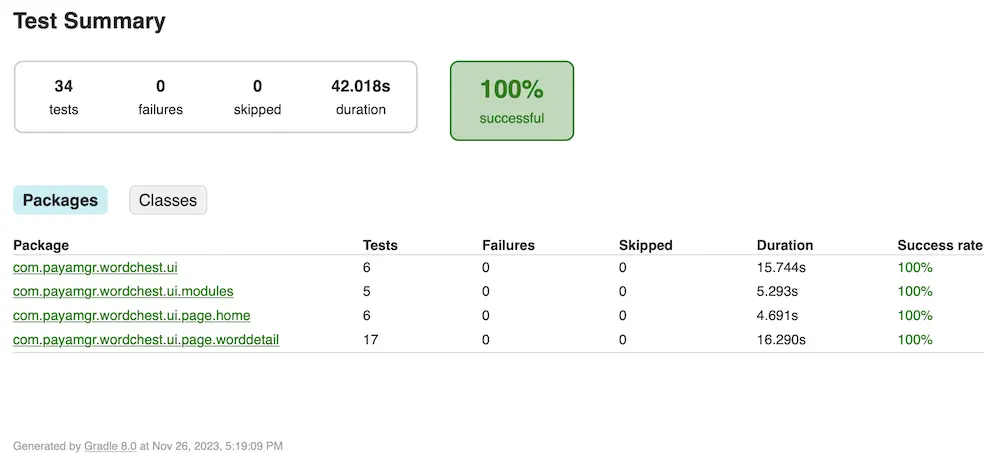
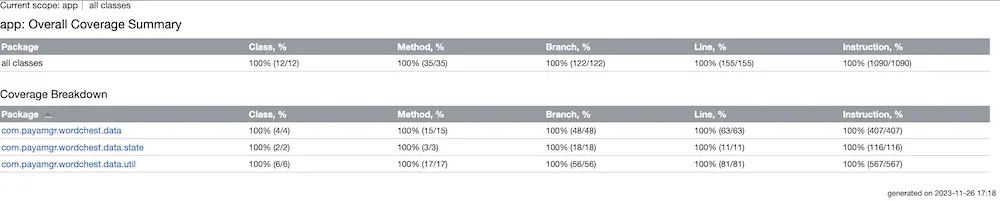
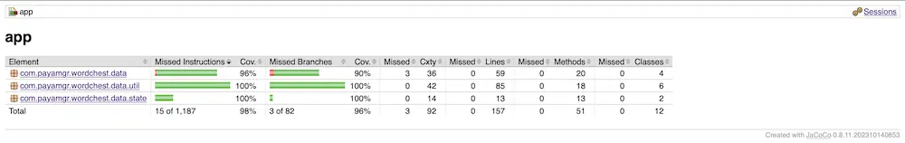

# Word Chest (Underdevelopment)
"Word Chest" is a dictionary and word memorization assistant app.

## Features
- [ ] Word Search
  - [x] Fake Data
  - [ ] Google MLKit
- [x] Word Details
  - [x] Fake Data
  - [x] Clickable Words
  - [x] History of Searches
- [ ] Word Reminder
- [ ] Language Selection

## Preview
### Home Page (Mock Mode)

### Word Detail Page (Mock Mode)

## Code Quality
### Unit Tests

### Android Tests

### Kover Report

### Jacoco Report

