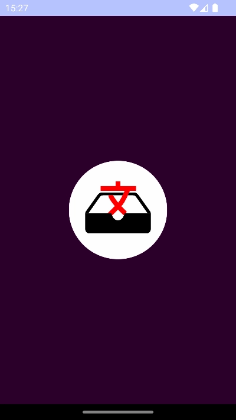
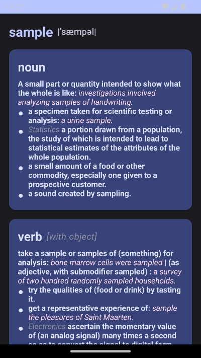
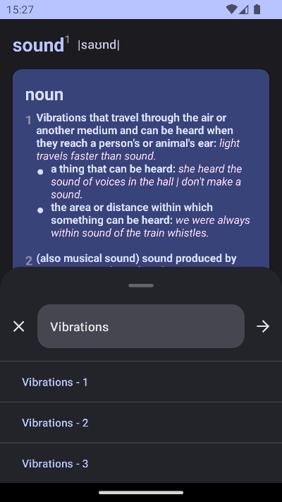

# Word Chest (Underdevelopment)
"Word Chest" is a dictionary and word memorization assistant app.

# Features
- Search
- Details
- History

# Screenshots
## Splashscreen


## Home Page (Mock Mode)


## Word Detail Page (Mock Mode)




# Code Quality
## Test Results ✅
### Unit Tests 💯

### UI Tests 💯


## Test Coverage 👍
### Kover Report 💯


### Jacoco Report


# Scripts
Some Unix scripts for the CI/CD and to make the screenshot capturing automatic.
Run the scripts from the project root directory.

## `take-screenshots.sh`
<!-- - Edit `adb` and `JAVA_HOME` in the script to the  -->
For the first time, set your `adb` and `JAVA_HOME` for `jdk-17` into the `env` file. Similar this on OSX:
```sh
rm -f scripts/env
echo 'adb=/Users/payam1991gr/Library/Android/sdk/platform-tools/adb' >> scripts/env
echo 'JAVA_HOME=/Applications/Android Studio.app/Contents/jbr/Contents/Home' >> scripts/env
```

From now on
- Run an android emulator device
- Run the script
```sh
./scripts/take-screenshots.sh
```
The results are stored in the `./docs/screenshots` directory.

❌ Don't put anything inside the `./docs/screenshots` folder. It would be cleaned-up everytime you call the `take-screenshots.sh` script.

# Todo
- [ ] Word Search
  - [x] Fake Data
  - [ ] Google MLKit
- [x] Word Details
  - [x] Fake Data
  - [x] Clickable Words
  - [x] History of Searches
- [ ] Word Reminder
- [ ] Language Selection
- [x] Screenshot improvement
  - [x] Home page soft keyboard should completely hide
  - [x] Screenshots should not have actionbars
